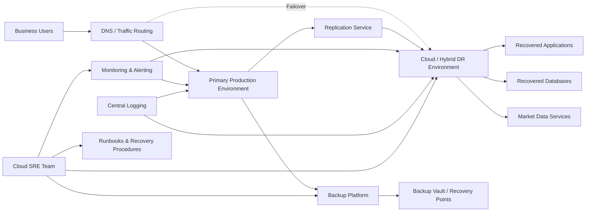
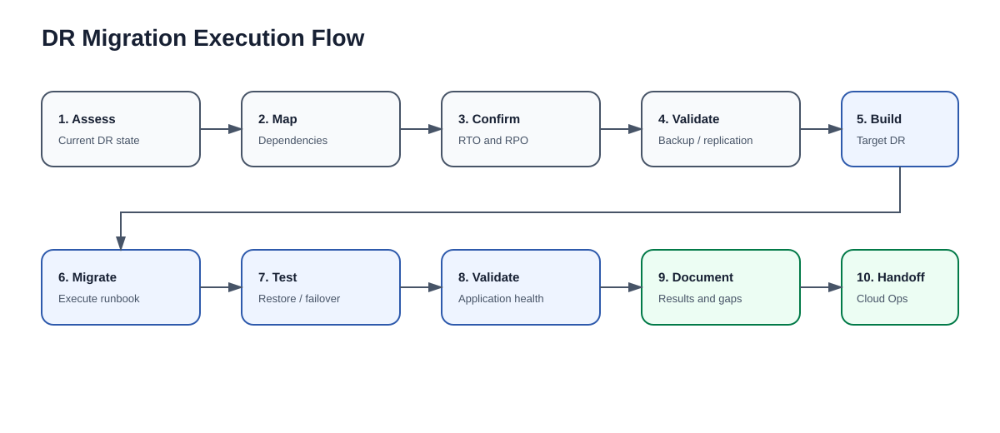
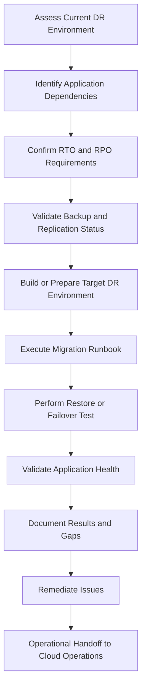
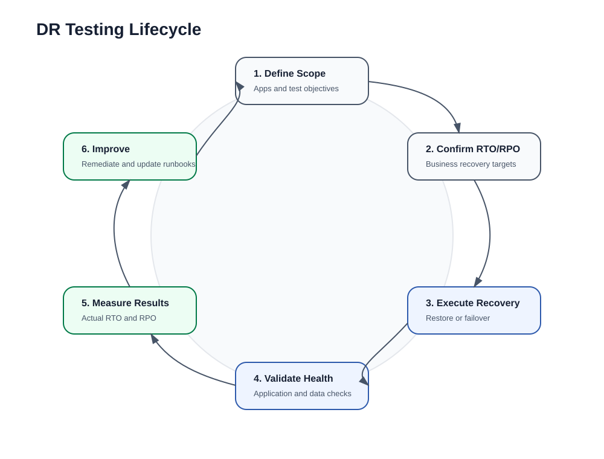
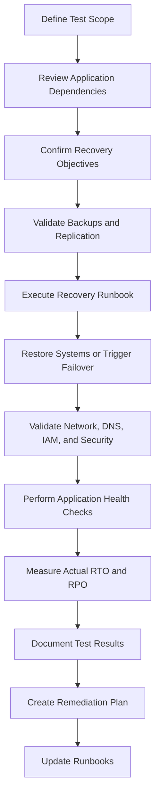
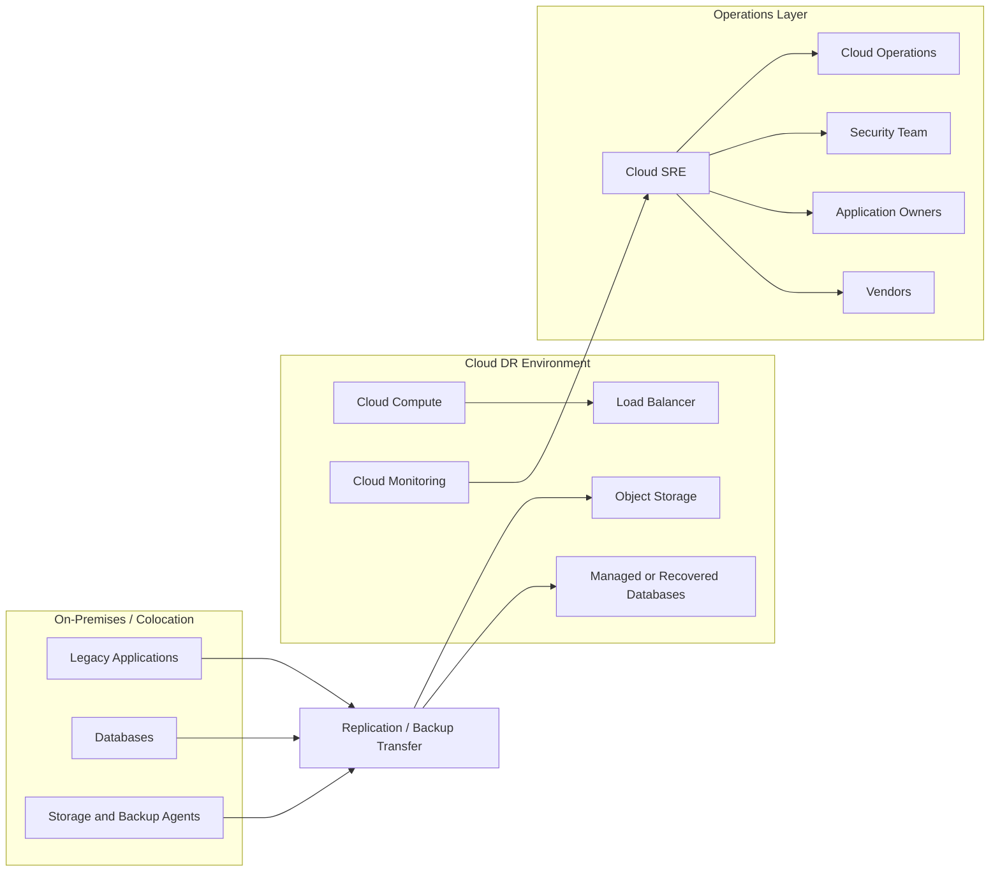
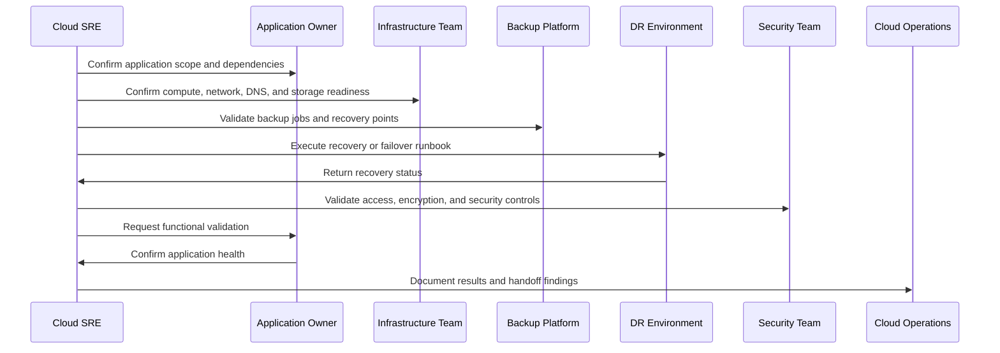
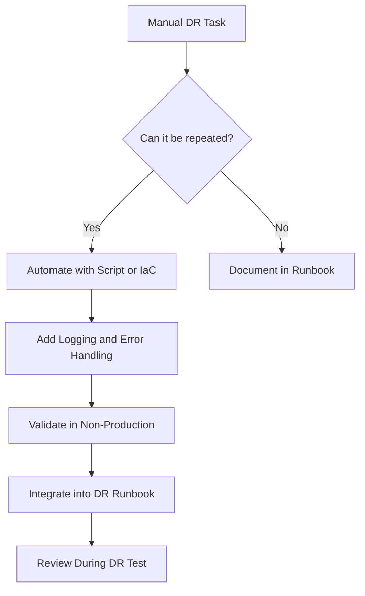
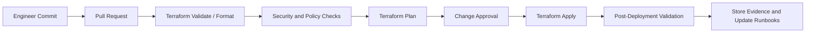

# Cloud Site Reliability Engineer – Disaster Recovery & Dallas Data Center Exit

## Project Overview

This repository documents the Cloud Site Reliability Engineering approach for supporting a critical infrastructure transition associated with a **Dallas Data Center exit** and the migration of **Disaster Recovery (DR)** and **backup environments** for US-hosted business applications.

The goal of this project is to ensure that business-critical workloads remain **available, recoverable, resilient, observable, and operationally ready** during and after the migration.

This README can be used as a project reference, interview discussion guide, operational handoff document, or technical portfolio artifact for a Cloud SRE role focused on disaster recovery and infrastructure migration.

---

## Business Context

Barings operates in a highly regulated financial services environment where application availability, data protection, operational discipline, and recovery readiness are critical. The Dallas Data Center exit requires careful migration of disaster recovery and backup capabilities without introducing unacceptable operational risk.

The Cloud SRE function supports this effort by helping plan, execute, validate, document, and operationalize the new DR and backup environment.

---

## Objectives

- Support the Dallas Data Center exit by migrating DR and backup environments.
- Ensure US-hosted business applications meet defined recovery objectives.
- Validate restore procedures, backup recoverability, and recovery sequencing.
- Support failover and failback planning for critical applications.
- Improve observability, documentation, and operational readiness.
- Track risks, dependencies, gaps, and remediation actions.
- Enable Cloud Operations teams to support the environment after migration.

---

## Scope

### In Scope

- Disaster Recovery planning and validation
- Backup verification and restore testing
- Cloud and hybrid infrastructure support
- DR environment migration
- Application dependency mapping
- Recovery sequencing
- Runbook execution and documentation
- Monitoring and alerting validation
- Post-migration operational handoff

### Out of Scope

- Redesigning business applications from scratch
- Replacing approved enterprise governance standards
- Unsupported changes outside approved change windows
- Production cutovers without rollback and validation planning

---

## High-Level Architecture

The target operating model supports hybrid infrastructure, cloud-based DR capabilities, backup validation, monitoring, and operational handoff.




---

## DR Migration Flow

The DR migration process follows a controlled and repeatable execution pattern.





---

## Disaster Recovery Concepts

### RTO – Recovery Time Objective

**RTO** defines how quickly an application or service must be restored after an outage.

Example:

> A business application must be restored within 2 hours after a major outage.

### RPO – Recovery Point Objective

**RPO** defines the maximum acceptable amount of data loss, measured in time.

Example:

> A database must not lose more than 15 minutes of data.

### Failover

Failover is the process of moving workload traffic and operations from the primary environment to the DR environment.

### Failback

Failback is the process of returning workload traffic and operations from the DR environment back to the primary environment after recovery.

### Restore Validation

Restore validation confirms that backups can be restored successfully and that the restored application, database, or dataset is usable.

### Backup Verification

Backup verification confirms that backup jobs completed successfully, restore points exist, retention policies are met, and the data is available for recovery.

---

## DR Testing Lifecycle





---

## Reference Architecture Components

| Component | Purpose |
|---|---|
| Primary Environment | Hosts production workloads before failover |
| DR Environment | Hosts recovered workloads during DR event or test |
| Backup Platform | Creates, manages, and retains backups |
| Backup Vault | Stores backup recovery points securely |
| Replication Service | Replicates application or database data to the DR target |
| DNS / Traffic Routing | Redirects traffic during failover and failback |
| Monitoring | Tracks system health, alarms, and recovery readiness |
| Logging | Centralizes application and infrastructure logs |
| Runbooks | Provides repeatable operational and recovery procedures |
| Change Management | Controls approved migration, test, and cutover activities |

---

## Cloud and Hybrid Operations View



---

## Suggested AWS Services for DR and Cloud Operations

| Capability | AWS Services |
|---|---|
| Compute recovery | EC2, Auto Scaling, AMIs, Launch Templates |
| Container workloads | ECS, EKS, Fargate |
| Backup management | AWS Backup, EBS snapshots, RDS snapshots, S3 versioning |
| Disaster recovery | AWS Elastic Disaster Recovery, multi-Region architecture |
| Storage | S3, EBS, EFS, FSx |
| Database recovery | RDS, Aurora, DynamoDB, snapshots, read replicas |
| Network connectivity | VPC, Transit Gateway, VPN, Direct Connect, Route 53 |
| Security | IAM, KMS, Secrets Manager, Security Groups, NACLs |
| Monitoring | CloudWatch, CloudTrail, Config, EventBridge |
| Automation | Terraform, CloudFormation, Systems Manager, Lambda |
| Logging | CloudWatch Logs, OpenSearch, S3 log archive |

---

## Operational Flow During DR Test



---

## SRE Responsibilities

### Disaster Recovery and Backup

- Validate backup job status and restore point availability.
- Confirm replication health and data protection coverage.
- Execute restore tests and document outcomes.
- Support failover and failback planning.
- Compare actual recovery performance against RTO and RPO.
- Identify gaps in backup, replication, monitoring, or runbooks.

### Infrastructure Migration

- Document current-state DR and backup environments.
- Support relocation or re-platforming of DR components.
- Validate target-state cloud or hybrid infrastructure.
- Execute approved migration procedures.
- Track cutover steps, rollback options, and post-migration validation.

### Cloud Operations

- Support compute, storage, networking, IAM, monitoring, and logging components.
- Validate operational readiness of the migrated environment.
- Confirm alerts, dashboards, backup schedules, and runbooks are in place.
- Work with Cloud Operations SMEs to support steady-state transition.

### Documentation and Governance

- Maintain DR test plans and execution evidence.
- Document recovery procedures and validation steps.
- Track risks, dependencies, and remediation actions.
- Support change management and audit-ready documentation.

---

## Runbook Template

Each DR runbook should include the following sections:

```text
1. Application Name
2. Business Owner
3. Technical Owner
4. Environment
5. Recovery Tier
6. RTO Requirement
7. RPO Requirement
8. Application Dependencies
9. Database Dependencies
10. Network and DNS Dependencies
11. IAM and Access Requirements
12. Backup Source
13. Recovery Point Selection
14. Failover Steps
15. Restore Steps
16. Application Startup Order
17. Validation Commands
18. Business Validation Steps
19. Rollback Plan
20. Failback Plan
21. Monitoring and Alert Validation
22. Known Risks
23. Test Results
24. Remediation Actions
25. Approval and Sign-Off
```

---

## Backup Verification Checklist

- [ ] Backup policy is assigned to the workload.
- [ ] Backup job completed successfully.
- [ ] Recovery point exists.
- [ ] Recovery point meets retention policy.
- [ ] Recovery point is encrypted.
- [ ] Restore test has been completed.
- [ ] Restored data was validated by the application or database owner.
- [ ] Backup failure alerts are configured.
- [ ] Backup documentation is updated.
- [ ] Evidence is stored for audit and operational review.

---

## Restore Validation Checklist

- [ ] Correct recovery point selected.
- [ ] Restore target environment available.
- [ ] Required IAM permissions confirmed.
- [ ] Network connectivity validated.
- [ ] Database restored successfully.
- [ ] Application services started in correct sequence.
- [ ] Application health checks passed.
- [ ] Logs reviewed for startup or data errors.
- [ ] Business owner validated application functionality.
- [ ] Actual RTO and RPO recorded.

---

## Failover Checklist

- [ ] Failover scope approved.
- [ ] Change window confirmed.
- [ ] Stakeholders notified.
- [ ] Replication status healthy.
- [ ] Backup status verified.
- [ ] DNS or traffic routing plan reviewed.
- [ ] DR compute resources available.
- [ ] Security groups, firewall rules, and IAM access validated.
- [ ] Monitoring and logging enabled.
- [ ] Application validation plan confirmed.
- [ ] Rollback plan approved.

---

## Failback Checklist

- [ ] Primary environment restored or confirmed healthy.
- [ ] Data consistency validated.
- [ ] Replication direction reviewed.
- [ ] Business approval received.
- [ ] DNS or routing cutback plan confirmed.
- [ ] Application startup order reviewed.
- [ ] Monitoring and alerting validated after failback.
- [ ] DR environment returned to standby state.
- [ ] Final documentation completed.

---

## Monitoring and Observability

A Cloud SRE should validate that both the primary and DR environments are observable before, during, and after migration.

### Key Metrics

| Area | Example Metrics |
|---|---|
| Compute | CPU, memory, disk, instance status checks |
| Network | Latency, packet loss, DNS resolution, VPN/Direct Connect status |
| Storage | Capacity, IOPS, throughput, snapshot status |
| Database | Replication lag, connections, query latency, backup status |
| Application | Health checks, error rates, response time, availability |
| Backup | Job success, job failure, restore point age, retention compliance |
| DR | Recovery success, RTO achieved, RPO achieved, failover readiness |

### Example Alert Categories

- Backup job failed
- Replication lag above threshold
- Recovery point missing
- DR environment unavailable
- Application health check failed
- Database restore failed
- DNS cutover validation failed
- RTO exceeded during test
- RPO target not met

---

## Automation Opportunities

Automation improves consistency and reduces recovery time.



### Automation Examples

- Terraform modules for DR infrastructure provisioning
- Python or Bash scripts for backup validation
- PowerShell scripts for Windows workload checks
- Ansible playbooks for configuration validation
- CI/CD pipeline checks for infrastructure drift
- Lambda functions for alert enrichment or backup status reporting
- Systems Manager automation documents for operational tasks

---

## Terraform Repository Structure

```text
barings-cloud-sre-dr/
├── README.md
├── assets/
│   ├── high-level-dr-architecture.svg
│   ├── dr-migration-flow.svg
│   └── dr-testing-lifecycle.svg
├── environments/
│   ├── dev/
│   │   ├── backend.tf
│   │   ├── main.tf
│   │   ├── providers.tf
│   │   ├── terraform.tfvars
│   │   └── variables.tf
│   ├── uat/
│   │   ├── backend.tf
│   │   ├── main.tf
│   │   ├── providers.tf
│   │   ├── terraform.tfvars
│   │   └── variables.tf
│   └── prod/
│       ├── backend.tf
│       ├── main.tf
│       ├── providers.tf
│       ├── terraform.tfvars
│       └── variables.tf
├── modules/
│   ├── network/
│   ├── compute/
│   ├── backup/
│   ├── monitoring/
│   ├── iam/
│   ├── kms/
│   └── dr-replication/
├── runbooks/
│   ├── dr-test-runbook.md
│   ├── backup-restore-runbook.md
│   ├── failover-runbook.md
│   └── failback-runbook.md
├── docs/
│   ├── dependency-mapping.md
│   ├── rto-rpo-matrix.md
│   ├── migration-plan.md
│   └── operational-handoff.md
└── scripts/
    ├── validate-backups.sh
    ├── validate-dns.sh
    ├── validate-app-health.sh
    └── collect-dr-evidence.sh
```

---

## CI/CD and Change Management Flow



---

## Risk Register

| Risk | Impact | Mitigation |
|---|---|---|
| Missing application dependency | Recovery failure | Perform dependency mapping before migration |
| Backup restore failure | Data unavailable | Conduct sample restore validation |
| Replication lag | RPO breach | Monitor lag and tune replication |
| DNS cutover issue | Application outage | Pre-test DNS updates and rollback plan |
| Access issue during recovery | Delayed RTO | Validate IAM and privileged access before test |
| Incomplete runbook | Execution delays | Review runbooks with all support teams |
| Monitoring gaps | Missed incidents | Validate alerts and dashboards before handoff |
| Vendor dependency delay | Migration delay | Track vendor tasks and escalation paths |

---

## RACI Matrix

| Activity | Cloud SRE | Cloud Ops | App Owner | Security | Infrastructure | Vendor |
|---|---|---|---|---|---|---|
| DR planning | R | A | C | C | C | C |
| Backup validation | R | A | C | C | C | C |
| Restore testing | R | C | A | C | C | C |
| Failover execution | R | A | C | C | C | C |
| Application validation | C | C | A | C | C | I |
| Security validation | C | C | C | A | C | I |
| Documentation | R | A | C | C | C | C |
| Operational handoff | R | A | C | C | C | C |

Legend:

- **R** = Responsible
- **A** = Accountable
- **C** = Consulted
- **I** = Informed

---

## 30-60-90 Day Execution Plan

### First 30 Days

- Review existing DR and backup documentation.
- Identify critical US-hosted business applications.
- Confirm RTO and RPO targets.
- Review current backup and replication status.
- Map application, database, network, and security dependencies.
- Review existing runbooks and identify documentation gaps.

### First 60 Days

- Support DR environment migration activities.
- Execute backup restore validation.
- Participate in failover planning and dry runs.
- Validate monitoring, alerting, logging, and operational controls.
- Track risks, issues, and dependencies.
- Update runbooks and recovery procedures.

### First 90 Days

- Execute full DR test for selected workloads.
- Document actual recovery performance against RTO and RPO.
- Remediate identified gaps.
- Complete operational handoff documentation.
- Confirm steady-state support model with Cloud Operations.
- Provide final migration and DR readiness evidence.

---

## Interview Talking Points

### Disaster Recovery

> I have hands-on experience supporting DR readiness by validating backup jobs, reviewing recovery points, confirming replication status, executing restore procedures, and documenting recovery results. I understand that a backup is only valuable when it can be restored successfully and validated by the application or business owner.

### Infrastructure Migration

> During migration activities, I focus on dependency mapping, target environment readiness, cutover planning, rollback procedures, post-migration validation, and clear communication with stakeholders.

### Cloud Operations

> My SRE approach is to make environments observable, recoverable, secure, and operationally supportable. That includes monitoring, incident response, automation, infrastructure validation, and documentation.

### Automation

> I use Terraform, scripting, and CI/CD practices to reduce manual effort, improve consistency, and make operational tasks repeatable.

### Documentation

> I treat runbooks as operational controls. They help teams execute recovery steps under pressure and provide evidence for governance, audit, and continuous improvement.

---

## Success Criteria

This project is successful when:

- DR and backup environments are migrated away from the Dallas Data Center dependency.
- Critical workloads have validated recovery procedures.
- Backup restore testing has been completed and documented.
- Actual RTO and RPO performance is measured.
- Risks and remediation actions are tracked to closure.
- Monitoring, logging, alerting, and runbooks are updated.
- Cloud Operations teams can support the environment in steady state.
- Business and technical owners approve DR readiness.

---

## Final Summary

The Cloud SRE role in this project is focused on execution, reliability, resiliency, and operational readiness. The engineer supports the migration of DR and backup environments, validates recoverability, tracks risks, documents procedures, and ensures cloud and hybrid infrastructure can support business continuity requirements.

A strong Cloud SRE mindset for this engagement is:

> Make the environment recoverable, observable, documented, secure, and operationally ready.
